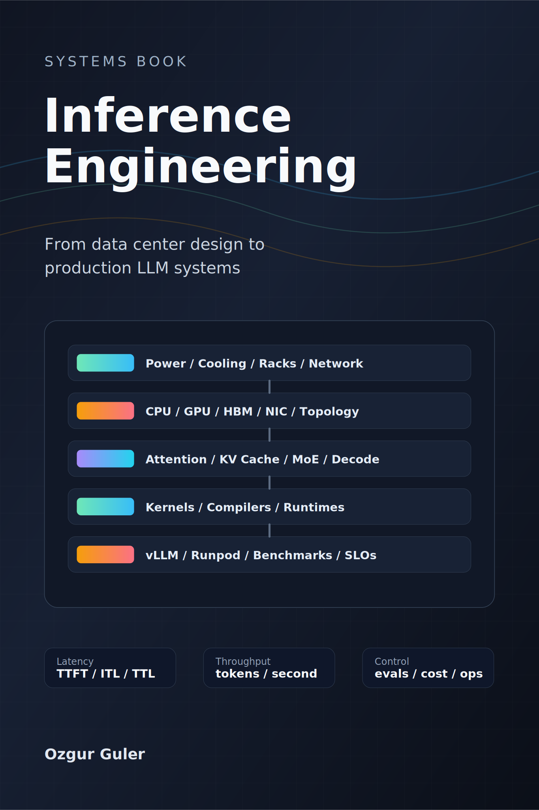

# Preface

::: {.book-landing}
{.book-cover fig-alt="Building an AI Data Center from Scratch book cover showing the stack from data center design to production AI systems."}

::: {.book-landing-copy}

Systems book

Building an AI data center from scratch means connecting physical facility
decisions to hardware architecture, inference runtimes, model mechanics, and
production operations.

Inference engineering, AI hardware, and data center design
for production AI systems.

:::
:::

::: {.stack-strip}

Data center design

AI hardware

Model mechanics

Production inference

:::

This book takes a stack-first view. It starts with the physical data center,
moves through hardware and model mechanics, then reaches kernels, serving
frameworks, advanced architectures, and production operations.

## Reader

This book is for engineers, platform teams, applied AI builders, and technical
leaders who need to operate LLM-backed systems in production.

The reader should be comfortable reading code, system diagrams, benchmark
tables, and architecture notes. Prior experience with distributed systems, APIs,
or machine learning helps, but the book should make each inference-specific
concept explicit.

## Book Promise

By the end, a reader should be able to:

- Compare AI data center design choices across power, cooling, racks, networks,
  storage, and operations.
- Explain how CPU, GPU, accelerator, memory, and network architecture affect
  inference performance.
- Build a metric system for latency, throughput, cost, quality, and reliability.
- Understand why attention, KV cache, long context, MoE, and RL-style workloads
  change serving behavior.
- Read kernel and compiler optimization claims without getting lost.
- Deploy and benchmark vLLM on an on-demand GPU environment such as Runpod.
- Evaluate speculative decoding, disaggregated inference, and specialized
  systems such as SambaNova, Cerebras, and Groq.
- Operate inference systems with evals, observability, reliability, security,
  and cost controls.

## How to Read

The chapters are organized in seven layers:

1. AI data center design.
2. Silicon, nodes, and hardware architecture.
3. Model mechanics that matter for inference.
4. Kernels, compilers, and runtime primitives.
5. Framework-first implementation.
6. Advanced inference architectures.
7. Production inference engineering.

Each chapter should eventually include:

- A concrete system, failure mode, benchmark, or decision.
- The core mental model.
- Implementation notes.
- A lab, artifact, or checklist.
- What to measure.
- What can go wrong.

The goal is a book that progresses cleanly from physical constraints to
operational judgment.
